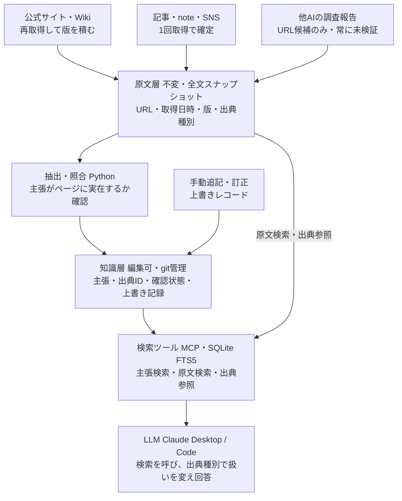

# 作品QAシステム 設計メモ

作成日: 2026-09-01

> これは実装前に書いた最初の設計メモである。実装して分かったこと・変更した点は
> [`design-review.md`](design-review.md) に分けて書いた。この文書は当時のまま残す。

## 1. 目的と前提

「作品○○について質問すると何でも答えてくれるシステム」を構築する。

- 情報ソースとして、原点となる資料（シナリオ脚本など）は使えない。
- 公式サイト・紹介記事・SNS・感想noteなどの二次情報を複合的に組み合わせる。
- 情報の追加・修正を可能とする。
- 利用者は自分のみ（外部公開しない）。

自分専用であることから、出典表示のデザイン、引用範囲の配慮、権限管理は不要。原文は全文保存で構わない。

## 2. 設計方針

成立条件は「原資料が使えない」ことより「二次情報の食い違いと更新をどう管理するか」にある。したがって、LLM＋検索（RAG）そのものより、**出典付きの主張単位で知識を保持し、上書き履歴を持つ**構造を要点とする。

## 3. 全体構造（3層）

### 3.1 原文層（不変）

公式サイト・記事・SNS・noteを、URL・取得日時・スナップショット本文ごと保存する。差し替えず追加のみ。

- スナップショット保存の目的は、更新され得るソースでは「版の記録」、更新されないソースでは「消失（削除・非公開化）対策」。
- 出典種別・取得日時・版番号をメタデータとして持つ。

### 3.2 知識層（編集可）

原文から抽出した「主張」を1件ずつ記録する。1レコードの項目:

| 項目 | 内容 |
|---|---|
| 内容 | 主張の本文 |
| 対象 | 人物・用語・出来事などのエンティティ |
| 出典ID | 原文層のどの版から抽出したか |
| 出典種別 | 公式サイト／公式SNS／インタビュー・記事／感想note など |
| 確認状態 | 公式確認・記事のみ・ファン解釈・矛盾あり・要再確認・未検証 |
| 改訂 | 有効期限または改訂番号 |

- 人手の追記・訂正もここに「上書きレコード」として入れる。古い主張を消さず、優先度で上に置く。元の主張と経緯の両方が追える。
- 抽出はLLMに任せてよいが、確認状態の付与は人手か、公式ドメイン判定など機械的ルールに限定する方が安定する。

### 3.3 回答層

質問 → 知識層を検索 → 出典種別ごとに扱いを変えて回答する。

- 公式確認の内容: 断定して回答。
- 記事のみ: 出典付きで提示。
- ファン解釈: 「解釈として」明示。感想noteは「感想として存在する」事実の根拠にはなるが、作品内の事実の根拠にはしない。
- 矛盾がある場合: 両方を並べる。

出典の優先順（公式サイト・公式SNS ＞ インタビュー・紹介記事 ＞ 感想note）を知識層の項目として持たせ、回答時のプロンプトで参照させる。

## 4. 出典種別と更新頻度の扱い

更新頻度は「出典種別」ごとの属性として持つ。

- **公式サイト・Wiki**: 再取得対象。取得日時付きで版を積み、知識層の主張は「どの版から抽出したか」を持つ。再取得で本文差分が出たら、その版に依存する主張だけを「要再確認」に落とす。
- **インタビュー・note・SNS**: 1回取得で確定。書き換わることは考えにくいが、削除・非公開化は起こるため、スナップショットは消失対策として保存する。
- **Wiki**: 主張の根拠にせず、原文層に置く「探索用インデックス」として扱う。記述の出典欄からリンク先を辿り、原資料の方を取り込む。

## 5. 他AIのDeep Research結果の取り込み

省力化の効果が出るのは「ソース探し」までで、主張の根拠にはならない前提を置く。他AIの調査結果には、存在しないURL、別ページの内容の混入、要約時の意味の変化が起こり得るため。

取り込み手順:

1. 結果を原文層に「AI調査報告」種別で保存する（確認状態は常に「未検証」固定）。
2. 報告からURLと主張の対を機械的に抽出し、候補リストにする。
3. 各URLを実際に取得し、主張がそのページに書かれているかを照合してから、通常の抽出ルートに流す。
4. 照合に失敗した主張は候補のまま残し、知識層には入れない。

Deep Researchは「URL発見器」として使い、根拠づけは自前の取得・照合で行う二段構え。この分離があれば、複数のAIの結果を並行して流し込んでも知識層の品質は落ちない。

## 6. 検索とLLMの接続

### 6.1 役割の分離

- **検索エンジン部分**: 全文検索（SQLite FTS5、Meilisearchなど）やベクトル検索（sqlite-vec、pgvector、Chromaなど）のライブラリ。どちらの方式でも必ず必要。
- **LLMとの接続部分**: 二択。
  1. アプリ側で先に検索し、結果だけをプロンプトに詰める（いわゆるRAG）。LLMは検索の存在を知らない。
  2. 検索をツールとしてLLMに渡す（MCPやtool use）。LLMが質問に応じて検索語を決め、必要なら複数回引き直す。

本システムでは **2（ツール形式）を初日から採用**する。Claude Desktop・Claude Codeからそのまま使えてUIを作らずに済み、「人物名で引いて足りなければ出来事名で引き直す」といった往復もLLM側で完結する。

### 6.2 ツール設計（3種）

1. **主張検索**: エンティティ名で知識層の主張一覧を返す。
2. **原文検索**: 全文検索で原文の該当箇所と出典IDを返す。
3. **出典参照**: 出典IDから原文の前後を返す。

返却値に確認状態と出典種別を必ず含め、回答側のプロンプトで「ファン解釈は解釈として述べる」などの扱いをその値に基づかせる。

### 6.3 全文検索とベクトル検索の使い分け

- 知識層（主張）は「対象エンティティ」「出典種別」「確認状態」で絞れる構造データのため、条件検索＋全文検索で足りる。人物名・用語名は表記が固定されやすく、キーワード一致で当たる。
- ベクトル検索が効くのは、原文層の記事・noteのように表現が揺れる長文で、言い換え検索（例:「あの場面で泣いたという感想」）をしたい場合。埋め込み生成コストと更新時の再計算が増えるため、後付けとする。

## 7. スモールスタートの方針

「規模感ごとの切り替え判断」を不要にするため、**接続部分を最初からツール形式に固定し、中身だけ差し替え可能にする**。

- LLMに渡すのは初日から「主張検索」「原文検索」「出典参照」の3ツール。
- 初期実装はSQLite FTS5。追加ライブラリなしでPython標準のsqlite3から使え、数百件でも数十万件でも同じコードで動くため、規模で実装を変える理由自体が消える。
- ベクトル検索は「新しい方式への切り替え」ではなく、同じ「原文検索」ツールの内部で全文検索と併用する追加機能として足す。呼び出し側のプロンプトやツール定義は変わらない。

スモールスタートの中身は「小さい実装」ではなく「小さい件数」。構造は最終形と同じものを最初から置く。

### 機能を足す時点の合図（主観にしない基準）

| 追加機能 | 合図 |
|---|---|
| ベクトル検索 | 全文検索で当たるはずの原文が、表現違いのせいで見つからない質問が実際に出た時。それまでは同義語をキーワードに足す方が安上がり |
| 検索結果の要約段階（該当箇所の前後を圧縮して渡す） | 1回の回答でツール結果がコンテキストの大部分を占め、回答品質や費用に影響した時 |
| 外部検索エンジン（Meilisearchなど） | SQLiteの応答が遅く感じた時。個人利用の文量では通常到達しない |

## 8. 実装スタック

- 知識層: git管理のMarkdown（1エンティティ1ファイル＋主張一覧）。差分・巻き戻し・CLAUDE.md的な運用と相性がよい。
- 取り込み（取得・抽出・照合）: Python。
- 検索: SQLite FTS5をMCPサーバーで包む構成が最小。
- 知識層が小さいうちは全件をコンテキストに渡しても動く。検索を挟むべきなのは原文層の方で、そこから着手する。
- （参考・任意）Drupalに載せる場合はノード＝エンティティ、Paragraph＝主張として知識層をそのまま表現でき、編集UIと改訂履歴を自前で作らずに済む。ただし自分専用のためUI構築は必須ではない。

## 9. 構成図

- 他AIの調査報告と手動訂正は、通常の抽出・照合ルートと経路が違う。
- 原文層は知識層を経由せず、検索ツールから直接引ける（知識層に載っていない記述も原文から拾える）。

## 10. 段階的な構築順

1. 原文層の保存形式（URL・取得日時・出典種別・本文）と、知識層のMarkdown形式を決める。
2. Pythonで取得スクリプトと、SQLite FTS5への取り込みを作る。
3. 3ツールを持つMCPサーバーを作り、Claude Desktop / Claude Codeに接続する。
4. 少量のソースで運用を始め、確認状態の運用ルール（誰が・どう付けるか）を固める。
5. 必要になった時点で、Deep Research取り込み、ベクトル検索、再取得の自動化を順に足す。

## 11. 未決事項

- 対象作品の確定と、公式サイトの再取得頻度。
- 知識層Markdownの具体的なスキーマ（フロントマターの項目名）。
- 矛盾検出（同一エンティティ内で相反する主張の検知）を機械化するか、人手運用にするか。
